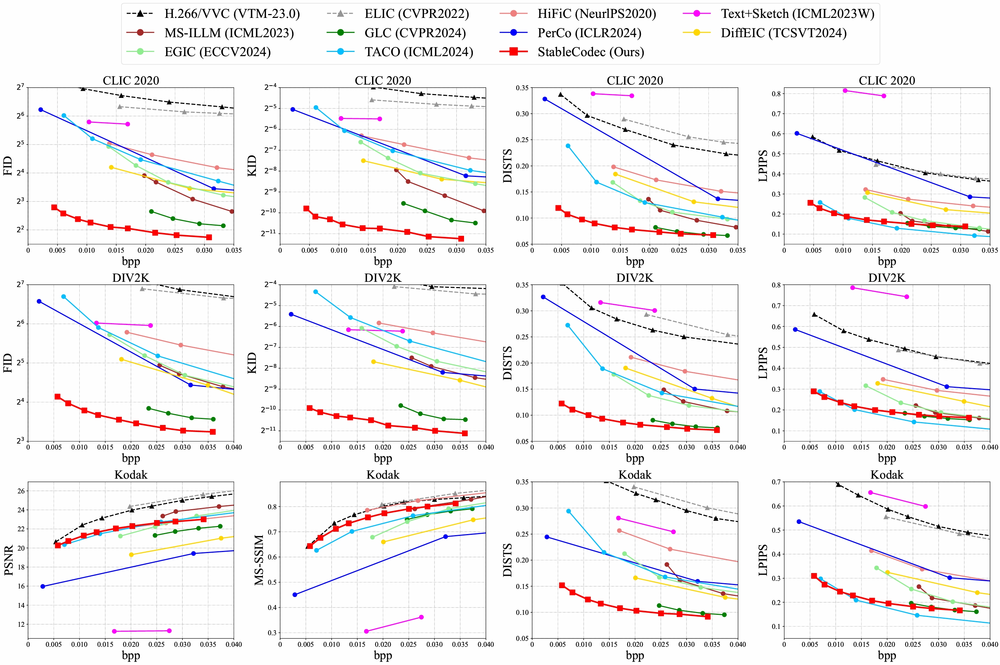

## StableCodec: Taming One-Step Diffusion for Extreme Image Compression

[](https://arxiv.org/abs/2506.21977) [](https://openaccess.thecvf.com/content/ICCV2025/html/Zhang_StableCodec_Taming_One-Step_Diffusion_for_Extreme_Image_Compression_ICCV_2025_paper.html) [](https://www.python.org/downloads/release/python-3100/) [](https://pytorch.org/get-started/locally/) 


***Tianyu Zhang, Xin Luo, Li Li, Dong Liu***

***University of Science and Technology of China***

⭐ **If StableCodec is helpful to you, please star this repo. Thanks!** 🤗

### :hourglass: Updates
**[2025/12/30] Release all source code. Leave it in 2025!**  
[2025/12/29] Release additional [checkpoints](https://drive.google.com/drive/folders/1itiVVAPSTATGPcHLp_bLI9r9Qi3YcM12?usp=sharing) for training and inference.  
[2025/08/21] Training logs and reported results are now available, see `results/`. 

### :hourglass: TODO
- [x] ~~Repo release~~
- [x] ~~Update paper link~~
- [x] ~~Demo~~
- [x] ~~Pretrained models~~
- [x] ~~Inference~~
- [x] ~~Training~~


## 📝 Abstract

Diffusion-based image compression has shown remarkable potential for achieving ultra-low bitrate coding (less than 0.05 bits per pixel) with high realism. However, current approaches: (1) Require a large number of denoising steps at the decoder to generate realistic results under extreme bitrate constraints. (2) Sacrifice reconstruction fidelity, as diffusion models typically fail to guarantee pixel-level consistency. To address these challenges, we introduce **StableCodec**, which enables one-step diffusion for high-fidelity and high-realism extreme image compression with improved coding efficiency. To achieve ultra-low bitrates, we first develop an efficient Deep Compression Latent Codec to transmit a noisy latent representation for a single-step denoising process. We then propose a Dual-Branch Coding Structure, consisting of a pair of auxiliary encoder and decoder, to enhance reconstruction fidelity. Furthermore, we adopt end-to-end optimization with joint bitrate and pixel-level constraints. StableCodec outperforms existing methods in terms of FID, KID and DISTS by a significant margin, even at bitrates as low as 0.005 bits per pixel, while maintaining (1) strong fidelity and (2) inference speeds comparable to mainstream transform coding schemes.


## 😍 Main Results

Rate-distortion-perception comparison on benchmarks:

[](https://imgsli.com/MzkzNjU5)

Compressing high-resolution images for more than 1000 times:

[](https://imgsli.com/MzkzNjA5)[](https://imgsli.com/MzkzNjEy)[](https://imgsli.com/MzkzNjM1)

[](https://imgsli.com/MzkzNjU5)[](https://imgsli.com/MzkzNjY5)[](https://imgsli.com/MzkzNjc5)

[](https://imgsli.com/MzkzNzA1)


## ⚙ Installation

```
conda create -n stablecodec python=3.10
conda activate stablecodec
pip install -r requirements.txt
```


## ⚡ Inference

**Step 1: Prepare your datasets for inference**
```
<PATH_TO_DATASET>/*.png
```
In our paper, we adopt the following test datasets: 
- [Kodak](https://r0k.us/graphics/kodak/): Contains 24 natural images with 512x768 pixels.
- [DIV2K Validation Set](https://data.vision.ee.ethz.ch/cvl/DIV2K/): Contains 100 2K-resolution images.
- [CLIC 2020 Test Set](https://archive.compression.cc/challenge/): Contains 428 2K-resolution images.

**Step 2: Download pretrained models**

1. Download [SD-Turbo](https://huggingface.co/stabilityai/sd-turbo).
2. Download [checkpoints](https://drive.google.com/drive/folders/1itiVVAPSTATGPcHLp_bLI9r9Qi3YcM12?usp=sharing) for StableCodec and Auxiliary Encoder ([ELIC](https://arxiv.org/abs/2203.10886)):

```bash
--- List ---
stablecodec_base.pkl		# A base model for Stage 2 finetuning
stablecodec_ft2.pkl			# ~ 0.035bpp on Kodak
stablecodec_ft3.pkl			# ~ 0.029bpp on Kodak
stablecodec_ft4.pkl			# ~ 0.025bpp on Kodak
stablecodec_ft6.pkl			# ~ 0.020bpp on Kodak
stablecodec_ft8.pkl			# ~ 0.017bpp on Kodak
stablecodec_ft12.pkl		# ~ 0.013bpp on Kodak
stablecodec_ft16.pkl		# ~ 0.010bpp on Kodak
stablecodec_ft24.pkl		# ~ 0.008bpp on Kodak
stablecodec_ft32.pkl		# ~ 0.005bpp on Kodak
elic_official.pth			# Pretrained ELIC model for Auxiliary Encoder
```

**Step 3: Inference for StableCodec**

Please modify the paths in `compress.sh`:

```bash
python src/compress.py \
    --sd_path="<PATH_TO_SD_TURBO>/sd-turbo" \
    --elic_path="<PATH_TO_ELIC>/elic_official.pth" \
    --img_path="<PATH_TO_DATASET>/" \
    --rec_path="<PATH_TO_SAVE_OUTPUTs>/rec/" \
    --bin_path="<PATH_TO_SAVE_OUTPUTs>/bin/" \
    --codec_path="<PATH_TO_STABLECODEC>/stablecodec_ft2.pkl" \
    # --color_fix
```

*Note: Color fix is recommended when inferring high-resolution images with tiling (e.g., DIV2K, CLIC 2020).* 

Then run:

```bash
bash compress.sh
```

You may find your bitstreams in specified `bin_path` and reconstructions in `rec_path` 🤗.


## 🍭 Evaluation (Optional)

Run the evaluation script to compute reconstruction metrics with `src/evaluate.py`

```bash
bash eval_folders.sh
```

Please make sure `recon_dir` and `gt_dir` are specified.


## 🔥 Training

**Preparations**

We perform lightweight training on `2x RTX 3090 (24G)` GPUs. Consider adjusting `train_batch_size` and `gradient_accumulation_steps` in `src/my_utils/training_utils.py` for faster or better training performance.  

Our training data includes:  
- [Flickr2K](https://github.com/LimBee/NTIRE2017): Contains 2560 2K-resolution images.
- [DIV2K Training Set](https://data.vision.ee.ethz.ch/cvl/DIV2K/): Contains 800 2K-resolution images.
- [CLIC](https://archive.compression.cc/challenge/): Contains 585 (CLIC 2020 Training) + 41 (CLIC 2020 Validation) + 60 (CLIC 2021 Test) 2K-resolution images.

We use `h5py` to organize training data. To construct a `.hdf5` training file, please refer to `src/my_utils/build_h5.py`.

*Note: An empirical finding suggests adding additional training data in Stage 1 improves stability. We adopt the first 10K images from [LSDIR](https://huggingface.co/ofsoundof/LSDIR/tree/main).* 

**Stage 1: Train a base model with relaxed bitrates**

*Note: You may skip Stage 1 with our pretrained [stablecodec_base.pkl](https://drive.google.com/drive/folders/1itiVVAPSTATGPcHLp_bLI9r9Qi3YcM12?usp=sharing).* 

Please modify the paths in `train.sh`:

```bash
accelerate launch --num_processes=2 --gpu_ids="0,1," --main_process_port 29300 src/train.py \
    --sd_path="<PATH_TO_SD_TURBO>/sd-turbo" \
    --elic_path="<PATH_TO_ELIC>/elic_official.pth" \
    --train_dataset="<PATH_TO_DATASET>/dataset.hdf5" \
    --test_dataset="<PATH_TO_DATASET>/Kodak/" \
    --output_dir="<PATH_TO_SAVE_OUTPUTS>/" \
    --max_train_steps 120000 \
    --lambda_rate 0.5
```

Then run:

```bash
bash train.sh
```

**Stage 2: Finetune the base model with GAN and target extreme bitrates**

Please modify the paths in `finetune.sh`:

```bash
accelerate launch --num_processes=2 --gpu_ids="0,1," --main_process_port 29300 src/finetune.py \
    --sd_path="<PATH_TO_SD_TURBO>/sd-turbo" \
    --elic_path="<PATH_TO_ELIC>/elic_official.pth" \
    --codec_path="<PATH_TO_STABLECODEC>/stablecodec_base.pkl" \
    --train_dataset="<PATH_TO_DATASET>/dataset.hdf5" \
    --test_dataset="<PATH_TO_DATASET>/Kodak/" \
    --output_dir="<PATH_TO_SAVE_OUTPUTS>/" \
    --max_train_steps 21000 \
    --lambda_rate 2 # [2, 3, 4, 6, 8, 12, 16, 24, 32]
```

Then run:

```bash
bash finetune.sh
```

## :book: Citation

If you find our work inspiring, please consider citing:
```bibtex
@InProceedings{Zhang_2025_ICCV,
    author    = {Zhang, Tianyu and Luo, Xin and Li, Li and Liu, Dong},
    title     = {StableCodec: Taming One-Step Diffusion for Extreme Image Compression},
    booktitle = {Proceedings of the IEEE/CVF International Conference on Computer Vision (ICCV)},
    month     = {October},
    year      = {2025},
    pages     = {17379-17389}
}
```


## :notebook: License

This work is licensed under MIT license.


## 🥰 Acknowledgement

This work is implemented based on [CompressAI](https://github.com/InterDigitalInc/CompressAI), [ELIC-Unofficial](https://github.com/JiangWeibeta/ELIC), [StableSR](https://github.com/IceClear/StableSR), [StableDiffusion](https://github.com/Stability-AI/stablediffusion) and [DCVC](https://github.com/microsoft/DCVC). Thanks for their awesome work!


## :envelope: Contact

If you have any questions, please feel free to drop me an email: 

- zhangtianyu[at]mail.ustc.edu.cn


