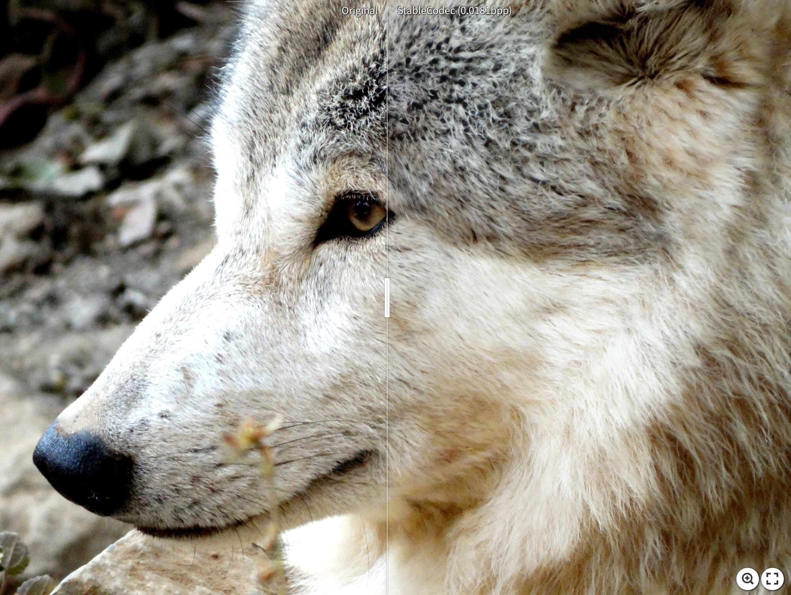
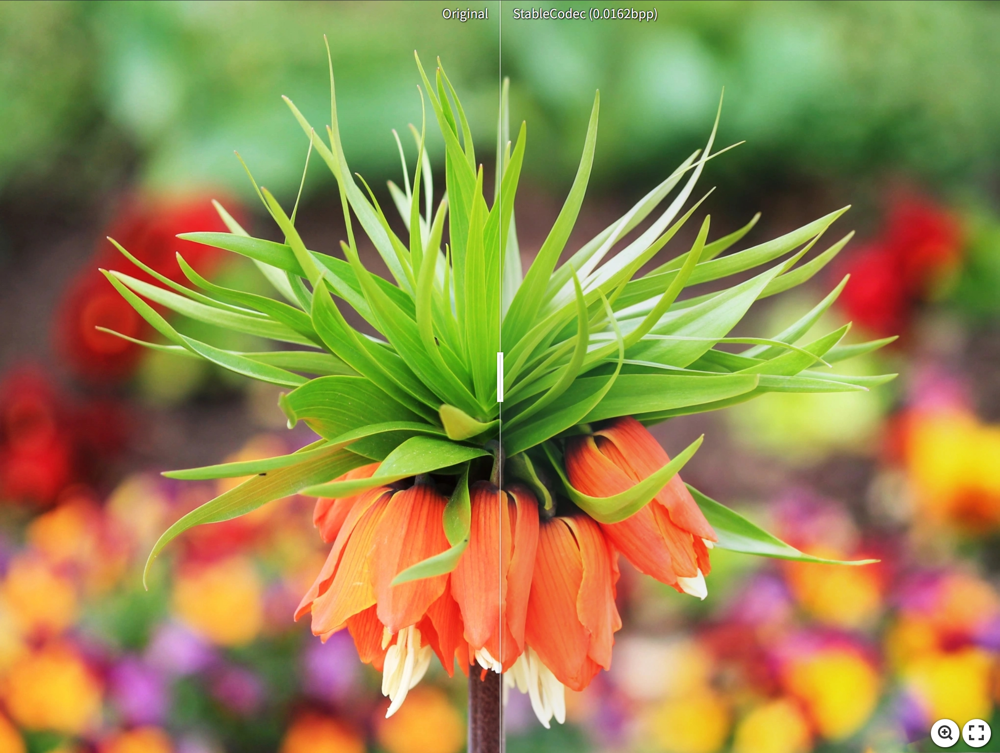
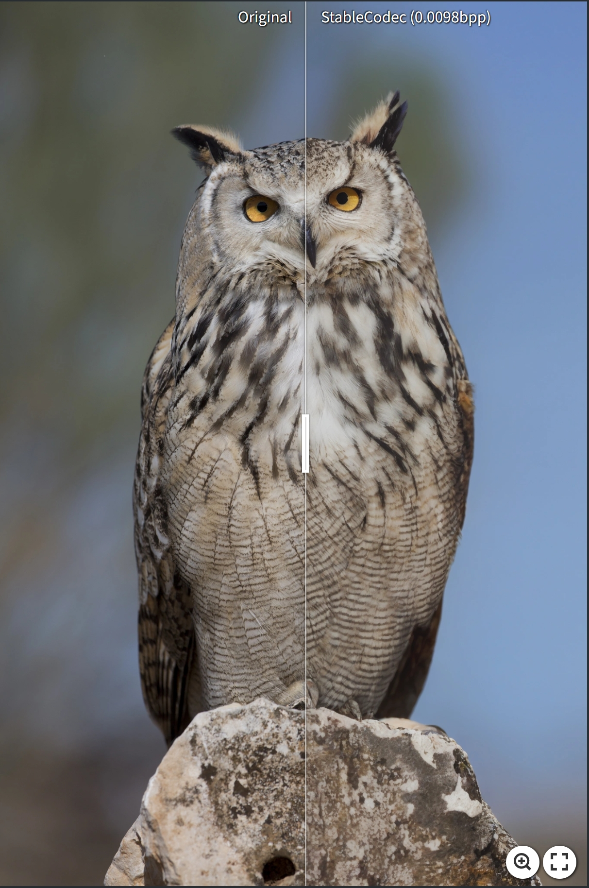
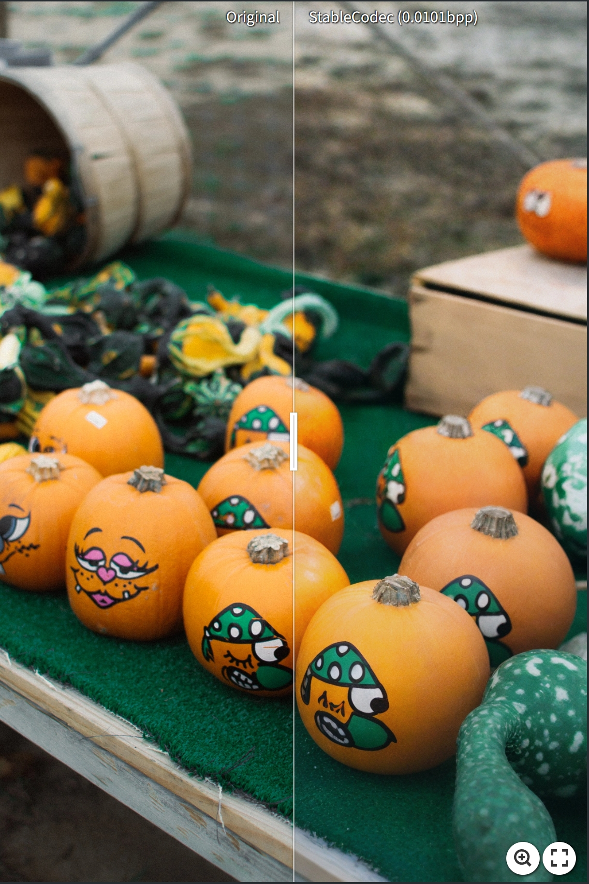
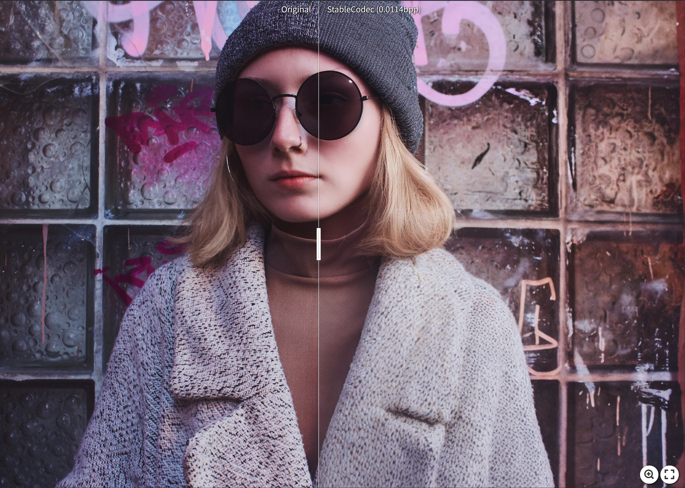
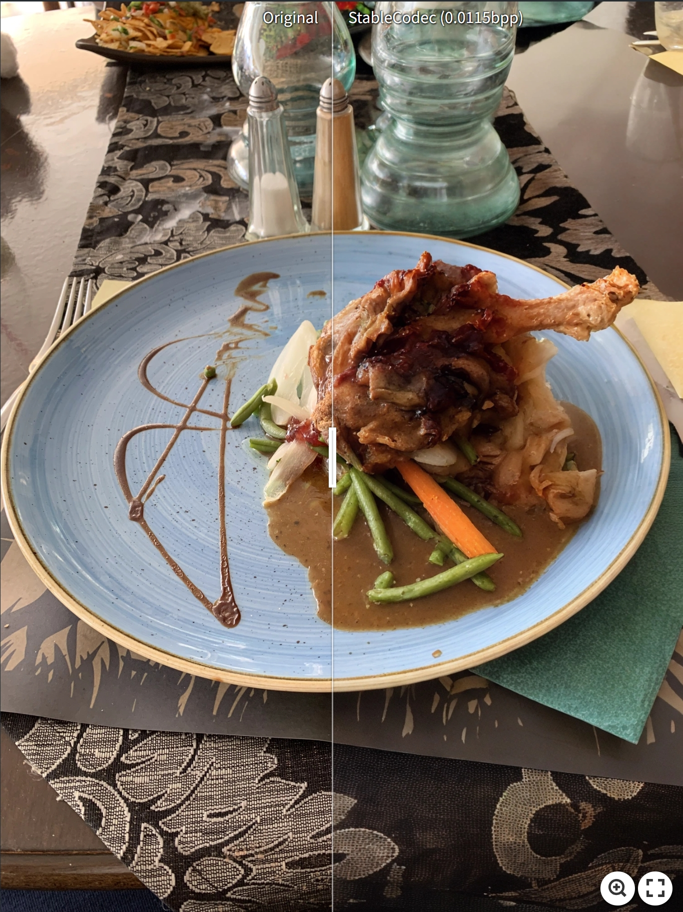

## StableCodec: Taming One-Step Diffusion for Extreme Image Compression

[](https://arxiv.org/abs/2506.21977) [](https://openaccess.thecvf.com/content/ICCV2025/html/Zhang_StableCodec_Taming_One-Step_Diffusion_for_Extreme_Image_Compression_ICCV_2025_paper.html) [](https://www.python.org/downloads/release/python-3100/) [](https://pytorch.org/get-started/locally/) 


Tianyu Zhang, Xin Luo, Li Li, Dong Liu

University of Science and Technology of China

⭐ If StableCodec is helpful to you, please star this repo. Thanks! 🤗

### :hourglass: News
[2025/8/21] Training logs and results of StableCodec are now [available](https://github.com/LuizScarlet/StableCodec/issues/4#issuecomment-3208858378). 

### :hourglass: TODO
- [x] ~~Repo release~~
- [x] ~~Update paper link~~
- [x] ~~Demo~~
- [x] ~~Pretrained models~~
- [x] ~~Inference~~
- [ ] Training


## 📝 Abstract

Diffusion-based image compression has shown remarkable potential for achieving ultra-low bitrate coding (less than 0.05 bits per pixel) with high realism. However, current approaches: (1) Require a large number of denoising steps at the decoder to generate realistic results under extreme bitrate constraints. (2) Sacrifice reconstruction fidelity, as diffusion models typically fail to guarantee pixel-level consistency. To address these challenges, we introduce **StableCodec**, which enables one-step diffusion for high-fidelity and high-realism extreme image compression with improved coding efficiency. To achieve ultra-low bitrates, we first develop an efficient Deep Compression Latent Codec to transmit a noisy latent representation for a single-step denoising process. We then propose a Dual-Branch Coding Structure, consisting of a pair of auxiliary encoder and decoder, to enhance reconstruction fidelity. Furthermore, we adopt end-to-end optimization with joint bitrate and pixel-level constraints. StableCodec outperforms existing methods in terms of FID, KID and DISTS by a significant margin, even at bitrates as low as 0.005 bits per pixel, while maintaining (1) strong fidelity and (2) inference speeds comparable to mainstream transform coding schemes.


## 😍 Visual Results

Compressing high-resolution images for more than 1000 times:

[](https://imgsli.com/MzkzNjA5)[](https://imgsli.com/MzkzNjEy)[](https://imgsli.com/MzkzNjM1)

[](https://imgsli.com/MzkzNjU5)[](https://imgsli.com/MzkzNjY5)[](https://imgsli.com/MzkzNjc5)

[](https://imgsli.com/MzkzNzA1)


## ⚙ Installation

```
conda create -n stablecodec python=3.10
conda activate stablecodec
pip install -r requirements.txt
```


## ⚡ Inference

**Step1: Prepare your datasets for inference**

**Step2: Download the pretrained models**

1. Download [SD-Turbo](https://huggingface.co/stabilityai/sd-turbo).
2. Download [checkpoints](https://drive.google.com/drive/folders/1itiVVAPSTATGPcHLp_bLI9r9Qi3YcM12?usp=sharing) for StableCodec and Auxiliary Encoder ([ELIC](https://arxiv.org/abs/2203.10886)):

```bash
--- List ---
stablecodec_ft2.pkl			# ~ 0.035bpp on Kodak
stablecodec_ft4.pkl			# ~ 0.025bpp on Kodak
stablecodec_ft8.pkl			# ~ 0.017bpp on Kodak
stablecodec_ft16.pkl		# ~ 0.010bpp on Kodak
stablecodec_ft32.pkl		# ~ 0.005bpp on Kodak
elic_official.pth			# Pretrained ELIC model for Auxiliary Encoder
```

**Step3: Inference for StableCodec**

Please modify the paths in `compress.sh`:

```bash
python src/compress.py \
    --sd_path="<PATH_TO_SD_TURBO>/sd-turbo" \
    --elic_path="<PATH_TO_ELIC>/elic_official.pth" \
    --img_path="<PATH_TO_DATASET>/" \
    --rec_path="<PATH_TO_SAVE_OUTPUTs>/rec/" \
    --bin_path="<PATH_TO_SAVE_OUTPUTs>/bin/" \
    --codec_path="<PATH_TO_STABLECODEC>/stablecodec_ft2.pkl" \
    # --color_fix
```

*Note: Color fix is recommended when inferring high-resolution images with tiling.* 

Then run:

```bash
bash compress.sh
```

You may find your bitstreams in specified `bin_path` and reconstructions in `rec_path` 🤗.


## 🍭 Evaluation (Optional)

Run the evaluation script to compute reconstruction metrics with `src/evaluate.py`

```bash
bash eval_folders.sh
```

Please make sure `recon_dir` and `gt_dir` are specified.


## :book: Citation

If you find our work inspiring, please consider citing:
```bibtex
@InProceedings{Zhang_2025_ICCV,
    author    = {Zhang, Tianyu and Luo, Xin and Li, Li and Liu, Dong},
    title     = {StableCodec: Taming One-Step Diffusion for Extreme Image Compression},
    booktitle = {Proceedings of the IEEE/CVF International Conference on Computer Vision (ICCV)},
    month     = {October},
    year      = {2025},
    pages     = {17379-17389}
}
```


## :notebook: License

This work is licensed under MIT license.


## 🥰 Acknowledgement

This work is implemented based on [CompressAI](https://github.com/InterDigitalInc/CompressAI), [ELIC-Unofficial](https://github.com/JiangWeibeta/ELIC), [StableSR](https://github.com/IceClear/StableSR), [StableDiffusion](https://github.com/Stability-AI/stablediffusion) and [DCVC](https://github.com/microsoft/DCVC). Thanks for their awesome work!


## :envelope: Contact

If you have any questions, please feel free to drop me an email: 

- zhangtianyu@mail.ustc.edu.cn


